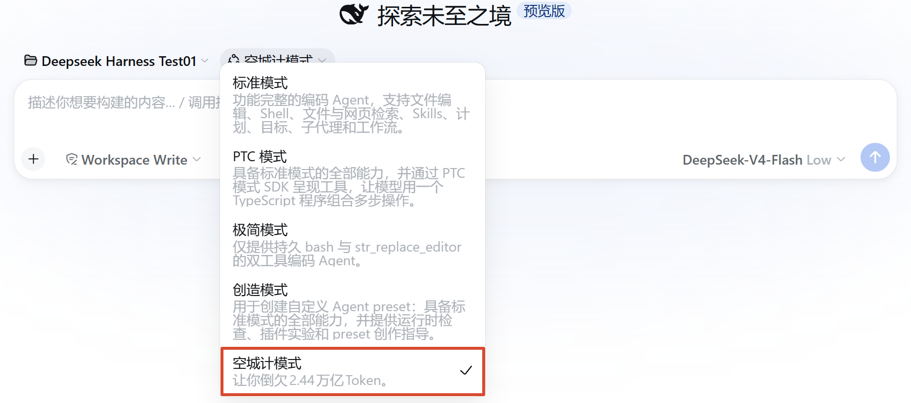

<h1 align="center">Empty Fort Strategy 空城计</h1>

<p align="center"><strong>
本项目纯属娱乐，无任何特殊含义</strong></p>

## 项目介绍

本项目是 [DeepSeek Harness](https://github.com/deepseek-ai/deepseek-harness)（dsh）的插件，感受空城计的巧妙，消耗多余的Token。

新增「空城计模式」，选中该模式后，无论你提问什么问题，模型都会进行多轮思考和数次工具调用（默认10轮），但是不会回答你的问题，最后只会输出一个换行（空城计）。



## 安装插件

### 1.快速安装

从 [Releases](https://github.com/HuaJi2077/empty-fort-strategy/releases) 下载 `empty-fort-strategy.zip`，解压后直接运行里面的 `install.bat`，它会自动完成两步：

1. 把「空城计模式」本体放入 dsh 的用户预设目录（等同于下面的手动拷贝）；
2. 把插件加入 Web UI 的插件列表（要求 PATH 里有 `dsh` 或 `npx` 命令，npx 方式首次运行需联网下载；使用 dsh 源码的用户请按下面「加入插件列表」的方法手动添加）。这一步是可选的，失败了也不影响使用。


Linux / macOS 用户解压后手动拷贝即可：

```bash
cp -r empty-fort-strategy/preset ~/.dsh/.agent-presets/empty-fort-strategy
```

然后重启 dsh（`pnpm dsh web`），**新开一个会话**，在模式选择器里选择「空城计模式」即可。

### 2.克隆仓库

**①必装，安装功能本体**

把仓库里的 `preset/` 目录整个拷到 dsh 的用户预设目录，目录名必须是 `empty-fort-strategy`：

```bash
git clone https://github.com/HuaJi2077/empty-fort-strategy.git
```

Windows（cmd）：

```bat
xcopy /E /I empty-fort-strategy\preset "%USERPROFILE%\.dsh\.agent-presets\empty-fort-strategy"
```

Windows（PowerShell）：

```powershell
Copy-Item -Recurse empty-fort-strategy\preset "$HOME\.dsh\.agent-presets\empty-fort-strategy"
```

Linux / macOS：

```bash
cp -r empty-fort-strategy/preset ~/.dsh/.agent-presets/empty-fort-strategy
```

然后重启 dsh（`pnpm dsh web`），**新开一个会话**，在模式选择器里选择「空城计模式」即可。


**②可选，加入插件列表**

如果你想在 Web UI 的 "设置 → 插件 → 插件列表" 里看到插件

```bash
# 本地路径安装
pnpm dsh plugin --profile web add /path/to/empty-fort-strategy

# 从 GitHub 安装
pnpm dsh plugin --profile web add github:HuaJi2077/empty-fort-strategy
```

验证插件是否加入列表：

```bash
pnpm dsh plugin --profile web list --depth 0
```

## 卸载插件

删除插件本体：

```bat
rmdir /S /Q "%USERPROFILE%\.dsh\.agent-presets\empty-fort-strategy"
```

从插件列表中移除：

```bash
pnpm dsh plugin --profile web remove empty-fort-strategy
```

## 配置插件

行为参数在 `preset/scenario.yml` 文件中：

| 字段 | 含义 | 规则 |
| --- | --- | --- |
| `thinkingRounds` | 思考轮数 | 最低为 2；若小于 toolCalls + 1 则会自动提升该值 |
| `toolCalls` | 工具调用次数 | 最低为 1；从 fake-tools.json 中随机取工具调用 |
| `outputFinal` | 是否输出结果 | `false`：默认值，只输出换行；`true`：输出正常结果 |

更改配置后需要重新拷贝 `preset/` 目录、重启 dsh、新开会话（配置在插件挂载时读一次）。dsh 启动日志里会打出实际生效的值：

```
empty-fort-strategy: scenario loaded — thinkingRounds=11, toolCalls=10, outputFinal=false
```

## 打包插件

运行 `script\package.bat`，它会：

1. 把 `preset/` 拷到 `dist\empty-fort-strategy\preset\`
2. 把 `package.json`、`cordis.patch.yml` 原样拷到 `dist\empty-fort-strategy\`（供 `dsh plugin add` 识别；全程纯文件拷贝，不做任何文本改写，避免编码损坏）
3. 把随包分发的 `script\install.bat` 放入 `dist\`
4. 压缩为 `dist\empty-fort-strategy.zip`

下载解压后运行 `install.bat` 就能直接安装，无需 clone 仓库。


打包 zip 内部结构：

```
├── empty-fort-strategy/
│   ├── package.json        # bundle 清单
│   ├── cordis.patch.yml    # 配置文件
│   └── preset/             # 模式本体
└── install.bat             # 安装脚本
```

## 项目结构

```
├── package.json          # 包信息 + 声明
├── cordis.patch.yml      # bundle 安装层
├── script/
│   ├── package.bat       # 打包 Release（本地构建用）
│   └── install.bat       # 安装脚本（随 Release 分发）
└── preset/               # 空城计模式本体
    ├── preset.yml        # 模式名称与介绍
    ├── agent.cordis.yml  # 组合：挂载插件
    ├── index.mjs         # 插件代码
    ├── scenario.yml      # 行为参数
    └── fake-tools.json   # 工具清单
```

## 许可证

[MIT](./LICENSE)
